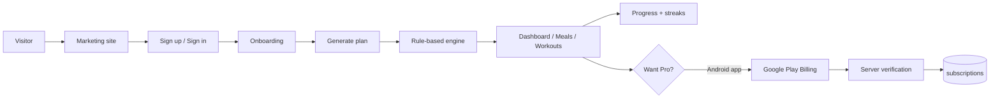

# 01. Executive Summary

**Status:** Implemented (documentation of a shipped web system; native app Partial)
**Last verified against commit:** 26c8ce4 · 2026-06-29

## 1. Purpose & Scope

FitPlanCoach is a fitness coaching platform that turns a short onboarding
questionnaire into a personalised calorie/macro target, a localised meal plan,
and a matched workout program — then keeps users engaged with progress tracking,
streaks, achievements, daily tips, and notifications. This chapter is the
honest, one-page-up executive view: what exists today, what is partial, and what
is not yet built. It is grounded in the Phase 1 inventory (`00_INVENTORY.md`).

## 2. Implementation

**What FitPlanCoach actually is today:** a server-rendered (SSR) web application
built on **TanStack Start + React 19**, backed by **Supabase** (Postgres, Auth,
Storage, Realtime). The personalisation logic is a **deterministic, rule-based
engine** — *not* an external LLM call — implemented in `src/lib/fitness-engine.ts`
(Mifflin–St Jeor BMR → TDEE → goal-adjusted calories → meal split → food
selection). This is a deliberate design choice: plans are reproducible,
explainable, free of per-request AI cost, and safe (calorie floors enforced).

The product has three surfaces:

- **Marketing website** — home, features, pricing, download, about, FAQ,
  contact, blog, and legal pages.
- **Authenticated app** (`/_app/*`) — onboarding, dashboard, meals, workouts,
  progress, profile, notifications, support, feedback, subscription.
- **Admin/owner console** (`/admin/*`) — 10 screens covering users, foods,
  exercises, workouts, blog, media, analytics, settings, and support triage.

**Monetisation** is subscription-based **Pro**, sold **only through Google Play
Billing inside the Android app** — never on the web. The server already verifies
Play purchase tokens against the Google Play Developer API and writes
entitlements (`src/lib/billing.functions.ts`); the entitlement model
(`src/lib/access.ts`) is the single source of truth for feature gating.

## 3. User & Data Flows

## 4. Dependencies

- **Frontend/runtime:** TanStack Start `1.167`, React `19.2`, Vite `8`,
  Tailwind v4 (Ch. 07).
- **Backend/data:** Supabase (Ch. 05, 06). Auth via Supabase (Ch. 11).
- **Billing:** Google Play Developer API (Ch. 12).
- **Email:** Lovable email send API + react-email templates (Ch. 06).

## 5. Limitations & Known Issues

- **No published native Android app yet.** Capacitor config exists; the native
  purchase trigger is a documented TODO. Pro cannot be *purchased* end-to-end
  until the Android build ships (Ch. 08, 12).
- **Generated `types.ts` is stale** relative to the newest migrations (blog,
  media, feature requests), so some queries use `const db: any` (Ch. 05).
- **Legacy `payment_*` tables** from a removed web-payment flow remain in the
  schema as tech debt (Ch. 05, 12).
- Third-party analytics (GA4/Clarity) and transactional email require operator
  configuration before they emit/send.

## 6. Planned Future Improvements

- Ship the Android wrapper and wire the native Play Billing purchase flow to the
  already-built server verifier.
- Regenerate `types.ts`; remove dead web-payment schema.
- See Ch. 26 (Future Roadmap) for the consolidated list.

---
**Source Files**
- `00_INVENTORY.md`
- `src/lib/fitness-engine.ts`
- `src/lib/access.ts`
- `src/lib/billing.functions.ts`
- `src/routes/` (marketing, `_app.*`, `admin.*`)
