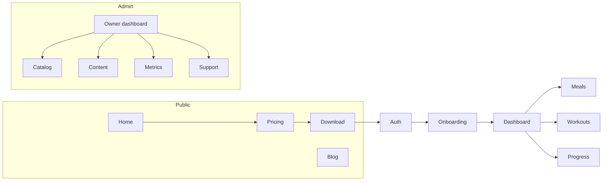

# 03. Product Overview

**Status:** Implemented
**Last verified against commit:** 26c8ce4 · 2026-06-29

## 1. Purpose & Scope

A map of the whole product: every user-facing surface, who it's for, and how the
surfaces connect. This is the orientation chapter that later feature chapters
drill into.

## 2. Implementation

**Three surfaces, 46 route files.**

**A. Marketing website (public).** `index` (home), `features`, `pricing`,
`download`, `about`, `faq`, `contact`, `blog` + `blog.$slug`, and legal
(`privacy`, `terms`, `refunds`, `delete-account`, `unsubscribe`). Shared chrome:
`PublicHeader`, `PublicFooter`, `AnnouncementBar`, `GooglePlayButton`,
`AppCtaBand`. Purpose: drive installs and rank in search (Ch. 09, 19).

**B. Authenticated app (`/_app/*`).** `onboarding` → `dashboard` → `meals`,
`workouts`, `progress`, `profile`, `notifications`, `support`, `feedback`,
`subscription`, `billing`. Shared chrome: `MobileShell` (app-like bottom nav,
mobile-first). Purpose: deliver and sustain the coaching experience.

**C. Admin / owner console (`/admin/*`).** `index` (owner dashboard), `users`,
`foods`, `exercises`, `workouts`, `blog`, `media`, `analytics`, `settings`,
`support`. Role-gated (`admin`/`owner`). Purpose: operate the business without
code changes (Ch. 10).

**Personas:**

| Persona | Primary surface | Key jobs |
|---|---|---|
| Prospect | website | understand value, install the app |
| Free user | app | onboard, generate first plan, track progress |
| Pro user | app | unlimited plans, advanced analytics |
| Admin/Owner | admin | catalog, content, metrics, support |

## 3. User & Data Flows

## 4. Dependencies

- Website (Ch. 09), App auth (Ch. 11), Admin (Ch. 10), engine (Ch. 13–14),
  memberships (Ch. 12).

## 5. Limitations & Known Issues

- The `_app/subscription` and `_app/billing` screens present the upgrade path but
  cannot complete a purchase on web by design (Ch. 12).
- Mobile-first layouts (`MobileShell`) are optimised for phone widths; desktop
  app-shell density is a known polish area (Ch. 07, `DESIGN_AUDIT.md`).

## 6. Planned Future Improvements

- Tighten desktop breakpoints for the app shell.
- Surface Pro benefits more prominently on the dashboard for free users.

---
**Source Files**
- `src/routes/` (all surfaces)
- `src/components/MobileShell.tsx`, `PublicHeader.tsx`, `PublicFooter.tsx`
