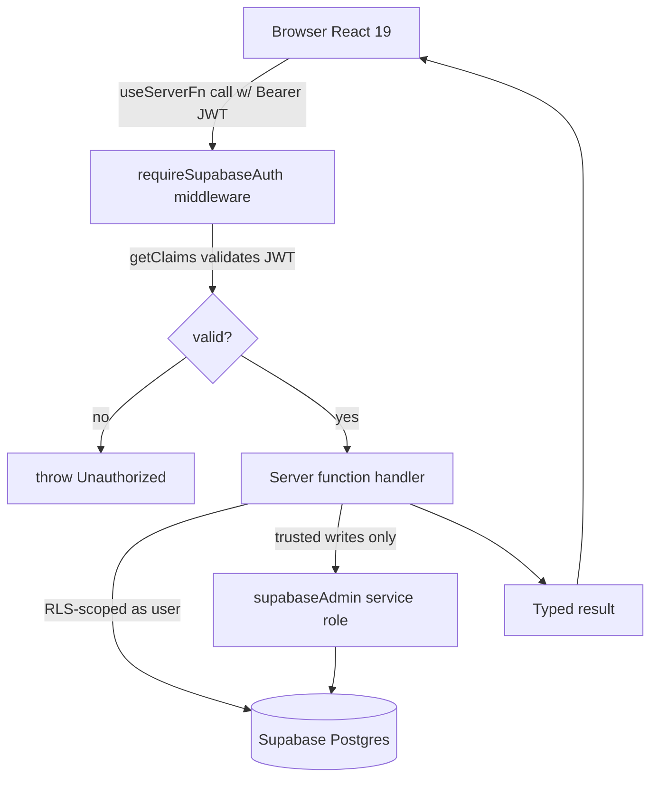

# 04. System Architecture

**Status:** Implemented
**Last verified against commit:** 26c8ce4 · 2026-06-29

## 1. Purpose & Scope

How the running system is structured end to end: the SSR web tier, the
client/server boundary, the two Supabase client identities, and how a request
flows from browser to database and back. Covers `vite.config.ts`,
`src/integrations/supabase/*`, and the server-function pattern shared by every
backend operation.

## 2. Implementation

**Composition root.** The app is configured through Lovable's preset
(`@lovable.dev/vite-tanstack-config`), which already wires `tanstackStart`,
`viteReact`, `tailwindcss`, `tsConfigPaths`, Nitro (Cloudflare default target),
the `@` path alias, env injection, and dev tooling. The project config only
redirects the SSR server entry to `src/server.ts` (an error-wrapping entry):

```ts
// vite.config.ts
export default defineConfig({
  tanstackStart: { server: { entry: "server" } },
});
```

**Tiers.**

- **Client** — React 19 components hydrated from SSR HTML; routing is
  file-based via TanStack Router (generated `src/routeTree.gen.ts`).
- **Server** — TanStack Start server functions (`createServerFn`) and a handful
  of server routes (`src/routes/api/*`), executed by Nitro.
- **Data** — Supabase Postgres with Row-Level Security; Storage for media;
  Realtime for notifications.

**Two Supabase identities (a security-critical distinction):**

| Client | Key | RLS | Where | Import |
|---|---|---|---|---|
| Browser/anon | publishable | **enforced** | client + RLS-scoped reads | `@/integrations/supabase/client` |
| Service-role admin | secret | **bypassed** | trusted server only | `await import("@/integrations/supabase/client.server")` |

The admin client is a lazy `Proxy` so the service-role client is only
constructed on first use inside a server handler, and the file carries an
explicit warning that it must never be imported into client-bound code
(`client.server.ts:60-69`).

**Request authentication** is middleware-based: `requireSupabaseAuth`
(`auth-middleware.ts:33-109`) reads the `Authorization: Bearer <jwt>`, validates
shape, calls `supabase.auth.getClaims(token)`, and injects
`{ supabase, userId, claims }` into the server-function context. Server functions
then run RLS-scoped queries as the user, or escalate to `supabaseAdmin` only for
specific trusted writes (e.g. incrementing `plan_count_used`).

## 3. User & Data Flows



## 4. Dependencies

- TanStack Start/Router, Nitro (build/runtime).
- Supabase JS client (Ch. 05, 06, 11).
- Lovable Vite preset (build configuration).

## 5. Limitations & Known Issues

- The Nitro default build target is Cloudflare (from the preset); the deployment
  chapter (Ch. 24) documents the actual hosting expectation. Environment
  variables must be present server-side or middleware throws a clear
  "Connect Supabase" error (`auth-middleware.ts:39-47`).
- `types.ts` staleness (Ch. 05) forces `any` casts at some DB call sites,
  weakening end-to-end type safety despite the architecture supporting it.

## 6. Planned Future Improvements

- Regenerate Supabase types to restore full type safety across the client/server
  boundary.
- Document/confirm the production hosting target explicitly in Ch. 24.

---
**Source Files**
- `vite.config.ts`
- `src/integrations/supabase/auth-middleware.ts`
- `src/integrations/supabase/client.server.ts`
- `src/integrations/supabase/client.ts`
- `src/lib/plan-generation.functions.ts`
