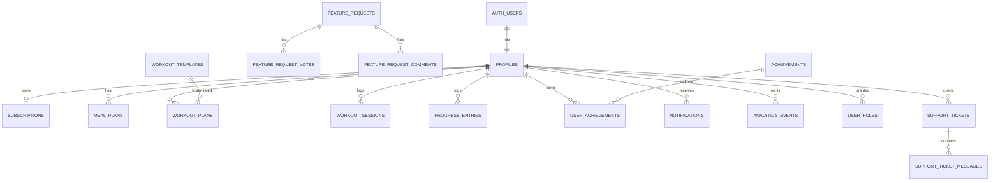

# 05. Database

**Status:** Implemented
**Last verified against commit:** 26c8ce4 · 2026-06-29

## 1. Purpose & Scope

The Supabase Postgres schema: the tables, their relationships, the security model
(RLS + SECURITY DEFINER helpers), and known schema debt. Authoritative column
definitions live in `supabase/migrations/` (30 migrations); this chapter is the
navigable map over them.

## 2. Implementation

**Table groups** (from `supabase/migrations/*`):

- **Identity & access:** `profiles` (1:1 with `auth.users`; onboarding fields
  `age, gender, height_cm, weight_kg, activity_level, goal, country,
  budget_level, onboarded`, plus engagement `streak_current, streak_longest,
  last_workout_date`), `user_roles` (role per user).
- **Monetisation:** `subscriptions` (`plan_type, status, billing_interval,
  provider, provider_ref, current_period_start/end, expiry_date, renews_at,
  cancel_at_period_end, plan_count_used`). Legacy `payment_*` + `billing_history`
  remain from the removed web flow (debt).
- **Coaching content (catalog):** `foods` (`country, calories_per_100g,
  protein_per_100g, category, budget_level, enabled`), `exercises`,
  `workout_templates` (`goal, level, schedule, enabled`).
- **User plans & activity:** `meal_plans`, `workout_plans`, `workout_sessions`,
  `progress_entries`, `achievements`, `user_achievements`, `notifications`.
- **Telemetry:** `analytics_events` (`user_id, event, meta, created_at`),
  `app_settings` (key/value config incl. `calorie_rules`, `free_plan_limit`).
- **Content/ops:** `blog_posts`, `media_assets`, `feature_requests` (+ `_votes`,
  `_comments`), `support_tickets` (+ `_messages`).
- **Email infra:** `email_send_log`, `email_send_state`,
  `email_unsubscribe_tokens`, `suppressed_emails`, `webhook_events`.

**Security model.** Row-Level Security is enabled across user-owned tables; the
policies lean on SECURITY DEFINER helper functions so role logic lives in one
audited place:

- `has_role(uuid, app_role)` — role membership check.
- `is_owner(uuid)` — owner check.
- `has_active_subscription` — entitlement helper.
- `plan_type_from_price`, `transfer_ownership` — billing/ownership ops.

Triggers (e.g. `update_updated_at_column`) maintain `updated_at`. Inserts to
`analytics_events` are RLS-restricted to the signed-in user (`analytics.ts:53`).

## 3. User & Data Flows

## 4. Dependencies

- Consumed by every server function (Ch. 06) and the admin console (Ch. 10).
- Generated types in `src/integrations/supabase/types.ts` (see debt below).

## 5. Limitations & Known Issues

- **Stale generated types.** `types.ts` predates the `blog_posts`, `media_assets`,
  and `feature_request*` migrations and still includes legacy `payment_*` tables.
  Call sites use `const db: any` to compensate, losing type safety.
- **Legacy payment schema.** `payment_approvals/settings/submissions`,
  `billing_history` are unused after the web-payment removal — should be dropped
  in a cleanup migration.
- Per-column constraints/RLS detail must be read from the individual migration
  files; this chapter summarises rather than reproduces them.

## 6. Planned Future Improvements

- Regenerate `types.ts` from the live schema (restores end-to-end typing).
- Cleanup migration to remove the legacy payment tables.
- Consider consolidating the 30 incremental migrations into a documented baseline.

---
**Source Files**
- `supabase/migrations/*` (30 files)
- `src/integrations/supabase/types.ts`
- `src/lib/plan-generation.functions.ts` (column usage), `src/lib/analytics.ts`
