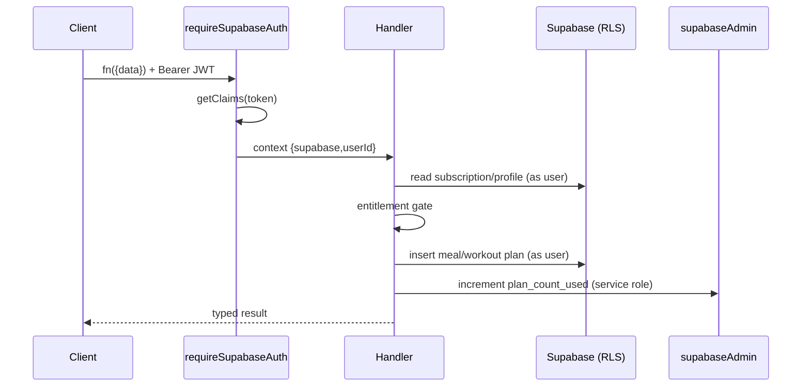

# 06. Backend

**Status:** Implemented
**Last verified against commit:** 26c8ce4 · 2026-06-29

## 1. Purpose & Scope

The server tier: how business logic runs, how input is validated, how
entitlements are enforced server-side, and the inventory of server functions and
server routes. The backend is not a separate service — it is TanStack Start
server functions co-located with the app, executed by Nitro.

## 2. Implementation

**The server-function pattern.** Every privileged operation follows one shape:

```ts
export const generateFitnessPlan = createServerFn({ method: "POST" })
  .middleware([requireSupabaseAuth])       // authn + injects {supabase,userId}
  .inputValidator((d) => zSchema.parse(d)) // Zod-validated input (where applicable)
  .handler(async ({ context, data }) => { /* ... */ });
```

Called from the client via `useServerFn(fn)` and invoked as `fn({ data })`.
Authentication is centralised in `requireSupabaseAuth` (Ch. 11), so handlers
receive a trusted `userId` and an RLS-scoped client.

**Server-side entitlement gate (the security spine).** Feature access is decided
on the server, never trusted from the client. The canonical example is plan
generation (`plan-generation.functions.ts:43-62`): it reads the user's
`subscriptions` row, computes `paidActive` from `plan_type`, `status`, and
`current_period_end`, and enforces the free-tier limit before doing any work:

```ts
const paidActive = planType !== "free" &&
  ((["active","trialing","past_due"].includes(status) &&
    (periodEndMs === null || periodEndMs > now)) ||
   (["canceled","cancelled"].includes(status) && periodEndMs !== null && periodEndMs > now));
if (!paidActive && freeUsed >= freeLimit)
  return { ok: false, reason: "needs_subscription", ... };
```

It then runs the pure engine, deactivates prior active plans, inserts the new
meal/workout plans (RLS-scoped as the user), increments `plan_count_used` via the
**service-role** client, and records a `plan_generated` analytics event.

**Server-function inventory (by domain):**

| Domain | Module | Responsibility |
|---|---|---|
| Plan generation | `plan-generation.functions.ts` | entitlement gate + engine + persistence |
| Billing | `billing.functions.ts` | Google Play token verification → `subscriptions` |
| Admin subscriptions | `admin-subscriptions.functions.ts` | staff-gated subscription ops |
| Analytics (admin) | `analytics-admin.functions.ts` | staff-gated event aggregation |
| Engagement | `engagement.functions.ts` | streaks/achievements |
| Support | `support.functions.ts` | ticket create/update |
| Blog | `blog.functions.ts` | post CRUD (service role) |
| Site config | `site-config.functions.ts` | whitelisted public config |
| Email | `email-send.server.ts`, `routes/lovable/email/*` | queue + send |

**Server routes** (`src/routes/api/*`): `sitemap[.]xml.ts` (SEO),
`public/lemonsqueezy/webhook.ts` (**retired → HTTP 410**), and Lovable email
infrastructure routes.

**Staff gating.** Admin operations verify role server-side via the SECURITY
DEFINER helpers `has_role(uuid, app_role)` / `is_owner(uuid)` (see Ch. 05, 20),
not by trusting a client claim.

## 3. User & Data Flows



## 4. Dependencies

- `requireSupabaseAuth` middleware (Ch. 11); Supabase clients (Ch. 04).
- Zod for input validation; the pure `fitness-engine` (Ch. 13, 14).

## 5. Limitations & Known Issues

- Not every handler uses an explicit `inputValidator` (some take no input or
  rely on RLS); inputs that exist are Zod-validated. Worth auditing for
  completeness (Ch. 20).
- `any` casts appear where `types.ts` is stale (Ch. 05).
- No automated backend test suite (Ch. 23).

## 6. Planned Future Improvements

- Add Zod validators to any remaining input-taking handlers.
- Introduce server-function integration tests around the entitlement gate.

---
**Source Files**
- `src/lib/plan-generation.functions.ts`
- `src/lib/billing.functions.ts`
- `src/lib/analytics-admin.functions.ts`
- `src/lib/support.functions.ts`, `src/lib/engagement.functions.ts`
- `src/routes/api/*`
