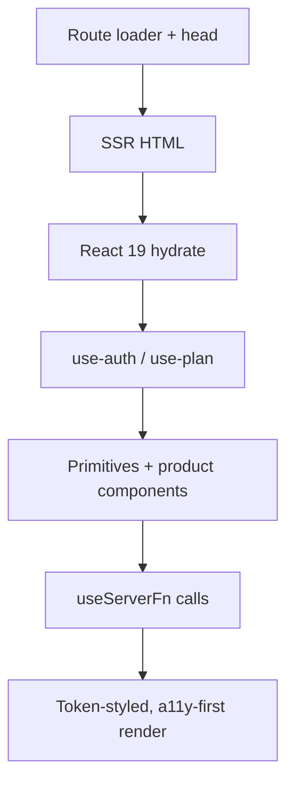

# 07. Frontend

**Status:** Implemented
**Last verified against commit:** 26c8ce4 · 2026-06-29

## 1. Purpose & Scope

The client architecture: routing, the component system, the design-token/styling
layer, state/data hooks, and the shared UI primitives that give the app and site
a consistent feel.

## 2. Implementation

**Routing.** File-based via TanStack Router; `src/routeTree.gen.ts` is generated
from the `src/routes/*` tree. Routes use `loader` + `head({loaderData})` for SSR
data and per-route SEO meta (Ch. 19).

**Component system.** 46 shadcn-style primitives in `src/components/ui/*`
(Radix-backed: dialog, popover, command, tabs, select, etc.), plus 19 product
components: layout (`MobileShell`, `PublicHeader/Footer`, `AnnouncementBar`),
marketing (`GooglePlayButton`, `PhoneMockup`, `AppScreens`, `AppCtaBand`,
`SocialLinks`, `Logo`), app (`app-ui` with `ProBadge`/`UpgradeCallout`/
`LockedFeature`/skeletons, `NotificationBell`, `ProgressRing`, `DailyTip`,
`WelcomeChecklist`), admin (`admin-ui` with `AdminHeader`/`StatCard`/
`AdminSectionLabel`), and CMS (`CountrySelect`, `MediaPicker`, `SiteScripts`).

**Styling & design tokens.** Tailwind v4 + `tw-animate-css`, configured in
`src/styles.css` with an oklch token system (lime primary), a Barlow Condensed
display font, motion tokens (`--ease-*`, `--duration-*`), and custom utilities
(`.surface-card`, `.card-lift`, `.metric-card`, `.label-overline`, `.prose`,
`.text-gradient`, `.bg-grid`). Global `:focus-visible`, branded `::selection`,
smooth scroll, and a `prefers-reduced-motion` reset are defined globally.

**Data & state hooks.** `use-auth` (session/context), `use-plan` (subscription →
`has(feature)`/`canGenerate`), `use-mobile` (breakpoint). Server data is fetched
via `useServerFn(fn)` and TanStack Query where caching helps. Charts use recharts
with a themed tooltip (`src/lib/chart.ts`). Toasts via `sonner`.

**Entitlement-aware UI.** `LockedFeature` renders a blurred teaser + glass unlock
CTA for free users; `ProBadge`/`UpgradeCallout` mark Pro surfaces — all driven by
`usePlan()`, never granting access client-side (Ch. 12).

## 3. User & Data Flows

## 4. Dependencies

- TanStack Router/Start, React 19, Tailwind v4, Radix UI, recharts, sonner,
  lucide-react, cmdk.
- Entitlement model (Ch. 12), SEO meta (Ch. 19), a11y foundations (Ch. 21).

## 5. Limitations & Known Issues

- Desktop density of the mobile-first app shell is a tracked polish item
  (`DESIGN_AUDIT.md`).
- Pixel-level visual proofing relies on the Lovable preview; this repo has no
  runnable `vite build`/browser here, so visual changes are principle-grounded
  and verified via `tsc` + ESLint (see `DESIGN_AUDIT.md` environment note).
- No component test/Storybook coverage (Ch. 23).

## 6. Planned Future Improvements

- Component visual regression coverage.
- Desktop breakpoint refinement for `_app` screens.

---
**Source Files**
- `src/routeTree.gen.ts`, `src/routes/*`
- `src/components/*`, `src/components/ui/*`
- `src/styles.css`, `src/hooks/*`, `src/lib/chart.ts`
- `docs/DESIGN_AUDIT.md`
