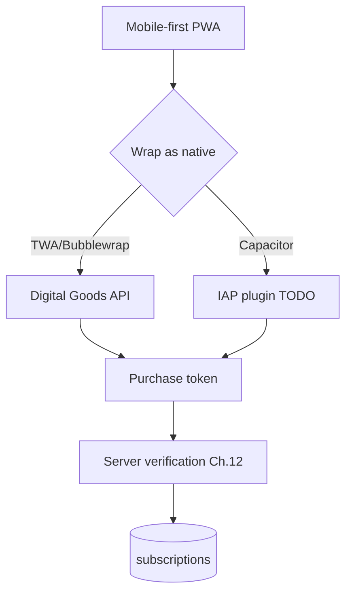

# 08. Mobile App

**Status:** Partial (PWA + Capacitor config present; native build/publish Planned)
**Last verified against commit:** 26c8ce4 · 2026-06-29

## 1. Purpose & Scope

The Android delivery story. FitPlanCoach is "Android-first" because membership is
sold through Google Play. This chapter documents what exists (a configured native
shell + a mobile-first PWA) and what does not (a built, signed, published APK and
the in-app purchase wiring).

## 2. Implementation

**Mobile-first PWA.** The app shell (`MobileShell`) is phone-optimised with an
app-like bottom navigation; the entire `_app/*` experience is designed for
handsets.

**Native shell config (`capacitor.config.ts`).** `appId =
com.fitplancoach.app`, `appName = FitPlanCoach`, `webDir = dist`. The file
documents two delivery paths and recommends, for this SSR PWA, either TWA/
Bubblewrap (which supports Play Billing via the Digital Goods API) or Capacitor
wrapping the deployed site in a native webview (`server.url =
https://fitplancoach.com`). **Capacitor dependencies are not installed** — this
is configuration, not a built app.

**Billing seam (`src/lib/billing.ts`).** `isAndroidApp()` detects the Capacitor
native platform. `startProPurchase()` / `restorePurchases()` are the documented
seams for the native IAP plugin and currently return `not_implemented`;
`verifyAndroidPurchase()` is ready to forward a purchase token to the
already-built server verifier (Ch. 12).

**Release metadata (`src/lib/app-config.ts`).** `APP_VERSION`,
`ANDROID_VERSION_CODE`, `ANDROID_MIN_VERSION`, and `PLAY_STORE_URL` /
`isPlayStoreLive` (driven by `VITE_PLAY_STORE_URL`) gate the "Get it on Google
Play" CTAs between "Coming soon" and live.

## 3. User & Data Flows

## 4. Dependencies

- Memberships (Ch. 12); `app-config.ts`; Google Play Console + signing (external).

## 5. Limitations & Known Issues

- **No published Android app.** *Disposition: blocked (external — Android build
  toolchain + Google Play Console + signing keystore).*
- Capacitor packages are not in `package.json` dependencies; adding them + the
  IAP plugin is part of the native build task.
- The Capacitor path loads the live site in a webview, so offline support is
  limited unless a static client build is shipped into `webDir`.

## 6. Planned Future Improvements

- Build, sign, and publish the Android app; wire the Play Billing plugin
  (Ch. 12 §6); set `VITE_PLAY_STORE_URL`.
- Add Real-time Developer Notifications for subscription lifecycle sync.

---
**Source Files**
- `capacitor.config.ts`
- `src/lib/billing.ts`, `src/lib/app-config.ts`
- `src/components/MobileShell.tsx`, `src/components/GooglePlayButton.tsx`
- `docs/LAUNCH.md` §6–§7
