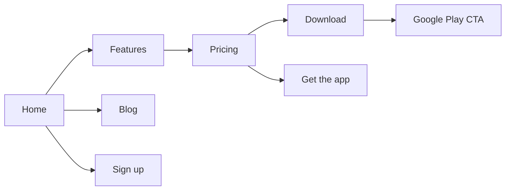

# 09. Website

**Status:** Implemented
**Last verified against commit:** 26c8ce4 · 2026-06-29

## 1. Purpose & Scope

The public marketing + content site: its pages, shared chrome, conversion paths,
and the rule that it **never sells memberships** (install-driving only).

## 2. Implementation

**Pages.** `index` (hero, feature highlights, app preview via `AppScreens` +
`PhoneMockup`, social proof, CTA bands), `features`, `pricing` (presents Pro but
routes purchase intent to the app), `download` (Play badge + app preview),
`about`, `faq`, `contact`, `blog` + `blog.$slug`, and legal (`privacy`, `terms`,
`refunds`, `delete-account`, `unsubscribe`).

**Shared chrome.** `PublicHeader` (nav + app CTA), `PublicFooter` (links, socials,
CMS-driven support email), `AnnouncementBar` (CMS-toggled message), `AppCtaBand`,
`GooglePlayButton` (live/coming-soon aware), `SocialLinks`.

**CMS-driven content.** Support email, social links, and the announcement bar are
editable in Admin → Settings (stored in `app_settings`, read via
`useSiteConfig()` / `getPublicSiteConfig`), so marketing copy/contact details
change without a redeploy (Ch. 10).

**Conversion model.** Every "buy/upgrade" intent on the web resolves to a "Get
the app" path; `GooglePlayButton` tracks `play_store_click`, signup CTAs track
`web_signup_click` (Ch. 16). No payment UI exists on the web (Ch. 12).

## 3. User & Data Flows

## 4. Dependencies

- Site config CMS (Ch. 10), SEO (Ch. 19), blog (Ch. 17), analytics (Ch. 16).

## 5. Limitations & Known Issues

- Deeper visual iteration on `features`/`download`/`about`/`faq` is tracked in
  `DESIGN_AUDIT.md` (benefits from the Lovable preview).
- Some marketing imagery is rendered from design tokens (`AppScreens`) rather
  than real screenshots — intentional (no binary assets) but less photographic.

## 6. Planned Future Improvements

- Real device screenshots once the app is published.
- Continued marketing-page visual polish per the design ledger.

---
**Source Files**
- `src/routes/index.tsx`, `features.tsx`, `pricing.tsx`, `download.tsx`,
  `about.tsx`, `faq.tsx`, `contact.tsx`, legal routes
- `src/components/PublicHeader.tsx`, `PublicFooter.tsx`, `AnnouncementBar.tsx`,
  `AppScreens.tsx`, `PhoneMockup.tsx`, `GooglePlayButton.tsx`
- `src/lib/site-config.ts`
