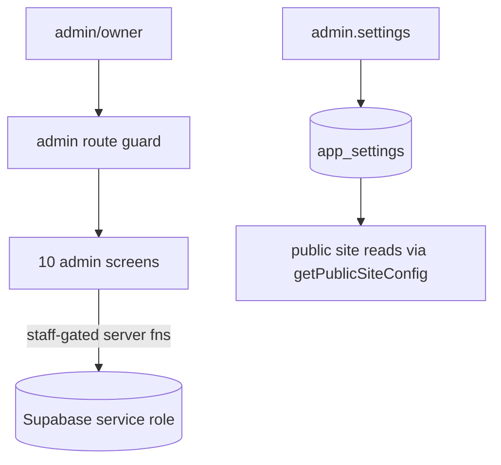

# 10. Admin CMS

**Status:** Implemented
**Last verified against commit:** 26c8ce4 · 2026-06-29

## 1. Purpose & Scope

The operator console that lets staff run the business — catalog, content,
metrics, configuration, and support — without code changes. Role-gated to
`admin`/`owner`.

## 2. Implementation

**Ten screens (`src/routes/admin.*`):**

| Screen | Manages |
|---|---|
| `admin.index` | Owner dashboard: MRR/ARR, DAU/WAU/MAU, conversion, tickets, top users |
| `admin.users` | User list + roles |
| `admin.foods` | Nutrition catalog (`foods`) |
| `admin.exercises` | Exercise catalog |
| `admin.workouts` | Workout templates |
| `admin.blog` | Blog post authoring/publishing |
| `admin.media` | Media library (upload, alt text) |
| `admin.analytics` | First-party analytics dashboards |
| `admin.settings` | Site config (support email, socials, announcement, GA4/Clarity) |
| `admin.support` | Support ticket triage (status/priority) |

**Shared design language (`src/components/admin-ui.tsx`).** `AdminHeader`,
`StatCard`, and `AdminSectionLabel` give every screen a consistent premium
header + metric layout; surfaces use `.surface-card`; charts use the themed
recharts tooltip (`src/lib/chart.ts`).

**Authorisation.** The `admin` route shell gates access; server functions behind
admin actions verify role server-side via `has_role`/`is_owner` (Ch. 06, 20) —
the client gate is convenience, the server gate is the control.

**Config without redeploy.** `admin.settings` writes whitelisted keys to
`app_settings`; the public site reads them through `getPublicSiteConfig`
(service-role, whitelisted) so secrets never leak (Ch. 09).

## 3. User & Data Flows

## 4. Dependencies

- Role helpers (Ch. 20), site config (Ch. 09), analytics (Ch. 16), blog (Ch. 17),
  media (Ch. 18), support (this chapter).

## 5. Limitations & Known Issues

- Admin screens require the role to be granted manually in SQL on first setup
  (`LAUNCH.md` §2) until the owner-bootstrap is used.
- Some admin tables rely on `const db: any` due to stale generated types (Ch. 05).
- No audit log of admin actions.

## 6. Planned Future Improvements

- Admin action audit trail.
- In-app role management UI for owners (reduce manual SQL).

---
**Source Files**
- `src/routes/admin.*` (10 screens)
- `src/components/admin-ui.tsx`, `src/lib/site-config(.functions).ts`,
  `src/lib/analytics-admin.functions.ts`
