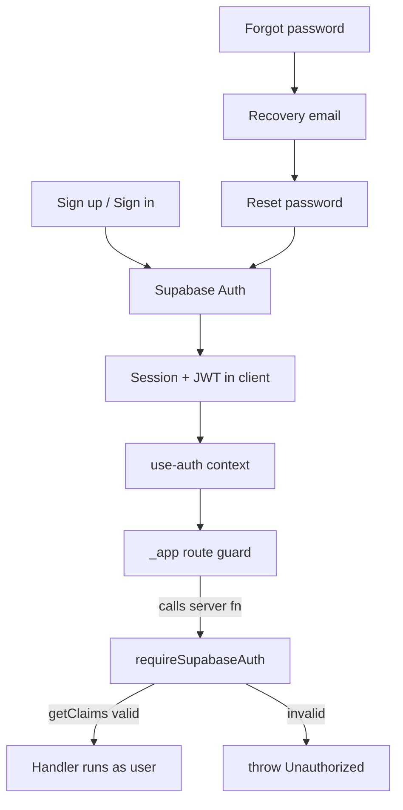

# 11. Authentication

**Status:** Implemented
**Last verified against commit:** 26c8ce4 · 2026-06-29

## 1. Purpose & Scope

How users sign up, sign in, recover access, and how the server proves a request
belongs to a user before doing privileged work. Covers the Supabase Auth
integration, the SSR auth middleware, and the client auth context.

## 2. Implementation

**Provider.** Supabase Auth (email/password + recovery). The browser client is
created in `src/integrations/supabase/client.ts` with the publishable key; a
React context (`src/hooks/use-auth.tsx`) exposes the current `user`/session to
the app and drives route protection on the `_app` shell.

**Auth surfaces (routes):**

- `auth.tsx` — combined sign in / sign up (mode-aware heading, password reveal,
  mobile input attributes, email normalisation, tablist a11y).
- `forgot-password.tsx` — request a recovery email.
- `reset-password.tsx` — set a new password with live validation (8+ chars,
  match) and an invalid-link guard.

**Server-side verification.** All privileged server functions run behind
`requireSupabaseAuth` (`auth-middleware.ts`). It:

1. Requires `Authorization: Bearer <jwt>`, rejecting missing/non-Bearer/
   malformed tokens (`:55-72`).
2. Constructs a request-scoped Supabase client bound to that token, with session
   persistence disabled (`:74-90`).
3. Validates the token via `supabase.auth.getClaims(token)` and requires a
   `sub` (user id) claim (`:92-99`).
4. Injects `{ supabase, userId, claims }` into the handler context (`:101-107`).

The middleware also handles the new opaque Supabase API key format (stripping a
bearer `Authorization` that equals the publishable key) via a custom `fetch`
wrapper (`:13-31`), and fails with an explicit, actionable error when Supabase
env vars are absent (`:39-47`).

**Authorisation** (distinct from authentication) is role-based via Postgres
SECURITY DEFINER helpers `has_role(uuid, app_role)` and `is_owner(uuid)`
(Ch. 05, 20), enforced in RLS policies and staff-gated server functions.

## 3. User & Data Flows

## 4. Dependencies

- Supabase Auth + JS client (Ch. 04, 05).
- `use-auth.tsx` context; `_app.tsx` shell guard.
- Recovery email delivery (Ch. 06 email infra).

## 5. Limitations & Known Issues

- Email/password only — no OAuth/social or MFA in the current build.
- Recovery email delivery depends on the email infra being configured
  (`LOVABLE_API_KEY`); otherwise recovery links are not sent.
- No rate-limiting visible at the app layer for auth attempts (relies on
  Supabase Auth's protections) — flagged for Ch. 20.

## 6. Planned Future Improvements

- Optional OAuth providers and MFA.
- Explicit app-layer rate-limit / lockout messaging.

---
**Source Files**
- `src/integrations/supabase/auth-middleware.ts`
- `src/integrations/supabase/client.ts`
- `src/hooks/use-auth.tsx`
- `src/routes/auth.tsx`, `src/routes/forgot-password.tsx`, `src/routes/reset-password.tsx`
