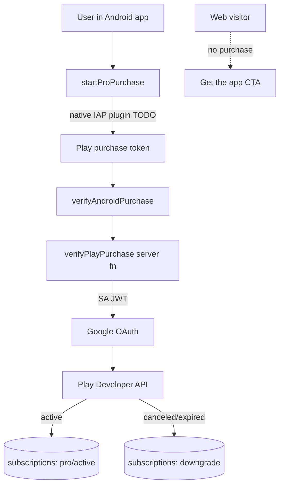

# 12. Memberships

**Status:** Partial (server verification Implemented; native purchase Planned)
**Last verified against commit:** 26c8ce4 · 2026-06-29

## 1. Purpose & Scope

How Pro is sold, verified, and enforced. The defining constraint: **premium is
sold only through Google Play Billing inside the Android app — never on the web.**
This chapter documents the entitlement model, the implemented server-side
verification, and the not-yet-built native purchase trigger.

## 2. Implementation

**Entitlement model (`src/lib/access.ts`).** A single `hasFeature(plan, feature)`
function is the source of truth for gating. `pro`/`premium`/`elite` all resolve
to Pro-level access for live features; `free` is limited (notably a configurable
plan-generation limit). The client uses `usePlan()` (`src/hooks/use-plan.ts`) to
read the subscription and expose `has(feature)`, but **the client never grants
entitlement** — it only reflects server state.

**Server-side verification (`src/lib/billing.functions.ts`) — IMPLEMENTED.** The
client sends only a Play `purchaseToken` + `productId`. The server:

1. Maps product → interval (`fitplancoach_pro_monthly`/`_annual`); rejects
   unknown products (`:39-40`).
2. Loads the Google Play service account from env, **failing closed** if absent —
   premium is never granted without it (`:43-64`).
3. Mints a Google OAuth token via an RS256 service-account JWT (`:66-100`).
4. Verifies the token against the Play Developer API
   (`purchases/subscriptionsv2/tokens/...`) and reads `subscriptionState`
   (`:102-123`).
5. On active/grace, writes `plan_type=pro, status=active, provider=google_play`
   and period/expiry to `subscriptions`; on canceled/expired, downgrades
   accordingly (`:132-155`).
6. Acknowledges the purchase if Google flags it pending (required within 3 days)
   (`:157-171`).

**Native purchase trigger (`src/lib/billing.ts`) — PLANNED.**
`startProPurchase()` and `restorePurchases()` short-circuit: web returns
`unavailable_on_web`; native returns `not_implemented` until the Capacitor IAP
plugin is wired. `verifyAndroidPurchase()` is ready to hand a token to the
verifier above. `isAndroidApp()` detects the Capacitor native shell.

**Web payments — REMOVED.** The legacy LemonSqueezy webhook
(`routes/api/public/lemonsqueezy/webhook.ts`) returns **HTTP 410 Gone**. The
website never sells memberships; pricing pages route purchase intent to the app.

## 3. User & Data Flows

## 4. Dependencies

- `access.ts` entitlement model; `use-plan.ts` (Ch. 07).
- Google Play Developer API + service account (env: `GOOGLE_PLAY_*`).
- Capacitor native shell (Ch. 08) for the purchase trigger.
- `subscriptions` table (Ch. 05).

## 5. Limitations & Known Issues

- **End-to-end purchase is not yet possible** — the native trigger is a TODO and
  no Android app is published. *Disposition: blocked (external — Play Console +
  native build).*
- Verification **fails closed** without `GOOGLE_PLAY_SERVICE_ACCOUNT_JSON` (or
  the discrete SA email/key). This is correct security behaviour but means a
  misconfigured environment silently grants nobody.
- Legacy `payment_*` tables remain (Ch. 05) — dead schema from the removed web
  flow.

## 6. Planned Future Improvements

- Wire the Capacitor in-app-purchase plugin to `startProPurchase` /
  `restorePurchases` and call the existing verifier.
- Add Google Play Real-time Developer Notifications (RTDN) to keep
  `subscriptions` in sync on renewals/cancellations without client round-trips.
- Remove legacy `payment_*` schema.

---
**Source Files**
- `src/lib/access.ts`
- `src/lib/billing.ts`
- `src/lib/billing.functions.ts`
- `src/hooks/use-plan.ts`
- `src/routes/api/public/lemonsqueezy/webhook.ts`
