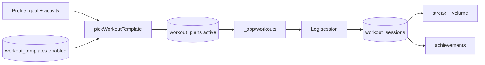

# 13. Workout System

**Status:** Implemented
**Last verified against commit:** 26c8ce4 · 2026-06-29

## 1. Purpose & Scope

How a user is matched to a training program, how workouts are logged, and how
logging feeds streaks/achievements. Covers the workout half of the rule-based
engine, the admin-managed template/exercise catalog, and the app workout screen.

## 2. Implementation

**Template selection (`fitness-engine.ts:133-151`).** `pickWorkoutTemplate(goal,
activity, templates)` maps activity level → training level
(sedentary/light → beginner, moderate → intermediate, active → advanced), filters
templates by goal (treating `lose_fat` templates as flexible for `maintain`),
and returns the best level match, degrading gracefully to any goal-matching
template, then any template, then `null`. It is a **pure function** — no I/O —
so selection is deterministic and testable.

**Persistence.** During plan generation (`plan-generation.functions.ts:85-104`)
the chosen template id + schedule are written to `workout_plans` (prior active
plans deactivated first), scoped to the user via RLS.

**Catalog (admin).** `admin.workouts.tsx` and `admin.exercises.tsx` manage
`workout_templates` and `exercises`; only `enabled` rows are eligible for
selection (`plan-generation.functions.ts:75`). The app reads the active plan in
`_app.workouts.tsx`.

**Logging & engagement.** Completed sessions are recorded in `workout_sessions`
(`performed_on`), which drives the streak computation surfaced on
`_app.progress.tsx` (current/longest streak from `profiles.streak_*`) and the
last-8-weeks training-volume chart. Achievements are awarded server-side
(`engagement.functions.ts`, tables `achievements`/`user_achievements`).

## 3. User & Data Flows

## 4. Dependencies

- `fitness-engine.ts` (pure selection) + `plan-generation.functions.ts`
  (persistence, Ch. 06).
- Tables `workout_templates`, `exercises`, `workout_plans`, `workout_sessions`
  (Ch. 05).
- `engagement.functions.ts` for streaks/achievements.

## 5. Limitations & Known Issues

- Selection is template-level, not per-exercise progression (no automatic
  load/volume periodisation across weeks).
- `schedule` is stored as opaque JSON (`unknown`), so its shape isn't
  type-enforced end to end.
- No automated tests around selection edge cases (Ch. 23).

## 6. Planned Future Improvements

- Progressive overload / week-over-week adjustment.
- Strongly-typed schedule schema (Zod) shared by admin authoring and rendering.

---
**Source Files**
- `src/lib/fitness-engine.ts` (`pickWorkoutTemplate`)
- `src/lib/plan-generation.functions.ts`
- `src/routes/_app.workouts.tsx`, `src/routes/admin.workouts.tsx`, `src/routes/admin.exercises.tsx`
- `src/lib/engagement.functions.ts`
