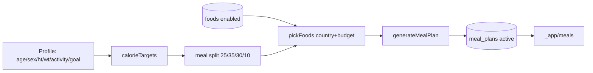

# 14. Nutrition System

**Status:** Implemented
**Last verified against commit:** 26c8ce4 · 2026-06-29

## 1. Purpose & Scope

How calorie/macro targets and a localised meal plan are produced from a user's
profile. Covers the calorie math, the meal-split allocation, the country/budget
food-selection strategy, and persistence.

## 2. Implementation

**Calorie & macro targets (`fitness-engine.ts:29-40`).** BMR uses Mifflin–St
Jeor (`10·kg + 6.25·cm − 5·age`, +5 male / −161 otherwise; `other` uses the
female constant for safety). TDEE = BMR × activity multiplier
(`sedentary 1.2 … active 1.725`). Calorie target = TDEE + goal adjustment
(`lose_fat −500`, `build_muscle +300`, `maintain 0`), **floored at 1200 kcal**.
Protein target = `2 g/kg` bodyweight. Rules are overridable via the
`calorie_rules` row in `app_settings` (`plan-generation.functions.ts:38-39`).

**Meal-split allocation (`fitness-engine.ts:68, 87-122`).** Calories are split
breakfast 25% / lunch 35% / dinner 30% / snack 10%. For each meal, up to two
distinct foods are chosen and the meal's calorie budget is divided between them;
grams are back-calculated from `calories_per_100g` (min 20 g), and calories/
protein are recomputed from grams so totals are internally consistent.

**Localised, budget-aware selection (`fitness-engine.ts:70-85`).** `pickFoods`
prefers, in order: local-country foods at the requested budget → local-country
foods at any budget → `global` foods at budget → any `global` foods. This yields
culturally relevant meals when the catalog has local data and degrades
gracefully to global staples otherwise — never returning an empty plan when
global foods exist.

**Persistence & gating.** `generateFitnessPlan` (Ch. 06) enforces the
server-side entitlement gate, runs the engine with the user's profile + the
`enabled` foods catalog, deactivates prior active meal plans, and inserts the new
plan into `meal_plans` (`calories_target`, `protein_target`, `meals` JSON).

**Catalog (admin).** `admin.foods.tsx` manages the `foods` table (name, country,
`calories_per_100g`, `protein_per_100g`, category, `budget_level`, `enabled`).
The app renders the active plan in `_app.meals.tsx`.

## 3. User & Data Flows

## 4. Dependencies

- `fitness-engine.ts` (`calorieTargets`, `generateMealPlan`, `pickFoods`).
- `plan-generation.functions.ts` (gate + persistence, Ch. 06).
- Tables `foods`, `meal_plans`, `app_settings` (Ch. 05).

## 5. Limitations & Known Issues

- Macro targeting is calorie + protein only — fat/carb targets are not
  individually optimised by the selector.
- Quality of localisation depends entirely on catalog coverage per country; thin
  catalogs fall back to `global`.
- No allergen/dietary-restriction filtering (e.g. vegetarian, halal) in the
  current selector.

## 6. Planned Future Improvements

- Dietary-preference and allergen filters in `pickFoods`.
- Full macro (carb/fat) balancing, not just protein.
- Per-food portion realism constraints (min/max sensible grams per food).

---
**Source Files**
- `src/lib/fitness-engine.ts` (`calorieTargets`, `generateMealPlan`, `pickFoods`)
- `src/lib/plan-generation.functions.ts`
- `src/routes/_app.meals.tsx`, `src/routes/admin.foods.tsx`
