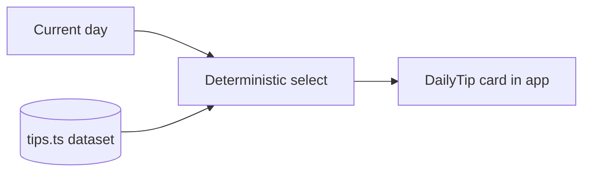

# 15. Daily Tips

**Status:** Implemented
**Last verified against commit:** 26c8ce4 · 2026-06-29

## 1. Purpose & Scope

The lightweight engagement feature that surfaces a rotating coaching tip to keep
users returning and reinforce healthy habits.

## 2. Implementation

Tips are a curated, in-code dataset (`src/lib/tips.ts`, ~140 lines) — no network
call, SSR-safe, and free. The `DailyTip` component (`src/components/DailyTip.tsx`)
selects a tip deterministically (e.g. by day) so a given day shows a stable tip,
and renders it within the app shell. Because the dataset is local, tips display
instantly and work offline.

## 3. User & Data Flows

## 4. Dependencies

- `src/lib/tips.ts`, `src/components/DailyTip.tsx`; app shell (Ch. 07).

## 5. Limitations & Known Issues

- Tips are static and code-managed — adding/editing requires a code change (not
  CMS-editable like blog/foods).
- No personalisation of tips by goal/profile yet.

## 6. Planned Future Improvements

- Make tips CMS-editable (a `tips` table + admin screen), and/or personalise by
  user goal.

---
**Source Files**
- `src/lib/tips.ts`
- `src/components/DailyTip.tsx`
