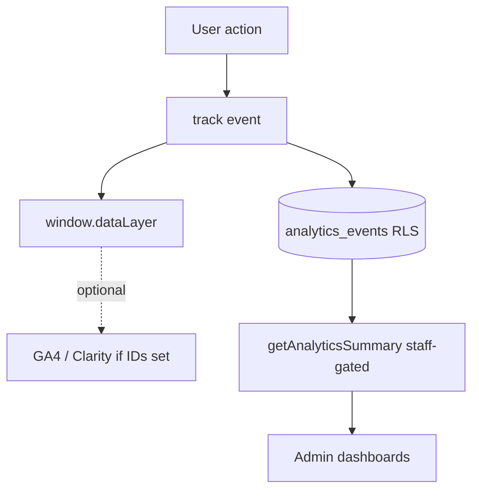

# 16. Analytics

**Status:** Implemented
**Last verified against commit:** 26c8ce4 · 2026-06-29

## 1. Purpose & Scope

How product usage is measured: first-party event capture, the optional
third-party vendors, and the owner-facing dashboards. Two layers work
independently so analytics never blocks a user flow.

## 2. Implementation

**First-party capture (`src/lib/analytics.ts`).** `track(event, meta)` is
SSR-safe (no-ops on the server) and **never throws** — it pushes to
`window.dataLayer` and best-effort persists to `analytics_events` when a Supabase
session exists (RLS restricts inserts to the signed-in user, `:53`). `usePageView()`
fires `page_view` on every route change. The canonical funnel events are typed:
`page_view, play_store_click, web_signup_click, signup, login, onboarded,
plan_generated, meal_generated, subscription_purchased`.

**Optional third-party (`src/components/SiteScripts.tsx`).** GA4 and Microsoft
Clarity snippets are injected at runtime **only when their IDs are set** in
Admin → Settings — nothing loads otherwise. The `dataLayer` design means a later
GTM/GA install captures the full journey without further app changes.

**Owner dashboards.**
- `admin.index` — business metrics computed live: MRR/ARR (from `subscriptions`
  + Play product prices), DAU/WAU/MAU (unique `analytics_events` users),
  conversion, signups/events time series, top engaged users, ticket alerts.
- `admin.analytics` — staff-gated aggregation via `analytics-admin.functions.ts`
  (`getAnalyticsSummary`, `ensureStaff`) over selectable 7/30/90-day ranges:
  totals, unique users, key metrics, daily series, and events-by-type.

## 3. User & Data Flows

## 4. Dependencies

- `analytics_events` table (Ch. 05), site config IDs (Ch. 10),
  `analytics-admin.functions.ts` (Ch. 06).

## 5. Limitations & Known Issues

- Anonymous events are captured only in `dataLayer` (RLS blocks anonymous DB
  inserts), so first-party DB metrics are authenticated-user only.
- Persistence is best-effort (failures are swallowed by design) — counts are
  directional, not billing-grade.
- Revenue figures on the dashboard use static product prices, not live Play
  financial data.

## 6. Planned Future Improvements

- Server-side event ingestion endpoint to capture anonymous funnel steps.
- Reconcile dashboard revenue against Play financial reports.

---
**Source Files**
- `src/lib/analytics.ts`, `src/components/SiteScripts.tsx`
- `src/lib/analytics-admin.functions.ts`
- `src/routes/admin.analytics.tsx`, `src/routes/admin.index.tsx`
