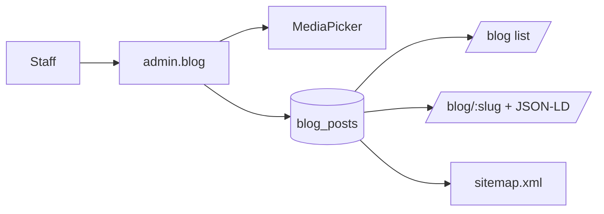

# 17. Blog

**Status:** Implemented
**Last verified against commit:** 26c8ce4 · 2026-06-29

## 1. Purpose & Scope

The content-marketing subsystem: authoring in the admin, public rendering, and
its SEO integration. Built to grow organic search traffic that drives installs.

## 2. Implementation

**Data layer (`src/lib/blog.ts`, `src/lib/blog.functions.ts`).** Posts live in
`blog_posts` (slug, title, excerpt, body markdown, cover image, status,
published_at). Server functions handle CRUD with service-role writes and
published-only public reads.

**Authoring (`src/routes/admin.blog.tsx`).** Staff create/edit posts, set a cover
image via the `MediaPicker` (Ch. 18), and publish/unpublish.

**Rendering.** `src/routes/blog.tsx` lists published posts; `blog.$slug.tsx`
renders a post via a `loader` + `head()` that emits `BlogPosting` JSON-LD. Body
markdown is converted by a **dependency-free, XSS-safe** renderer
(`src/lib/markdown.tsx`) that escapes HTML and maps a safe Markdown subset to
React — no `dangerouslySetInnerHTML`, no third-party markdown lib.

**SEO.** The sitemap auto-includes published posts (`sitemap[.]xml.ts`); each
post has canonical + Open Graph + JSON-LD (Ch. 19).

## 3. User & Data Flows

## 4. Dependencies

- `blog_posts` (Ch. 05), media (Ch. 18), markdown renderer, SEO (Ch. 19).

## 5. Limitations & Known Issues

- Markdown renderer supports a deliberate safe subset — exotic markdown/HTML is
  not rendered (a security trade-off, by design).
- No scheduled publishing or draft preview links.
- Blog tables aren't in generated `types.ts` yet (Ch. 05) — queries use `any`.

## 6. Planned Future Improvements

- Scheduled publish + preview tokens.
- Tags/categories and related-posts.

---
**Source Files**
- `src/lib/blog.ts`, `src/lib/blog.functions.ts`, `src/lib/markdown.tsx`
- `src/routes/admin.blog.tsx`, `src/routes/blog.tsx`, `src/routes/blog.$slug.tsx`
