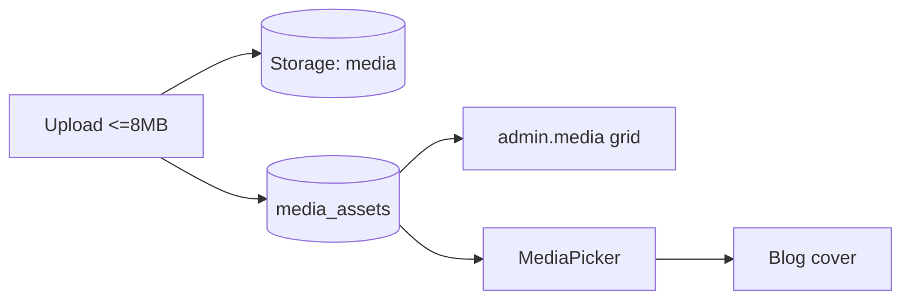

# 18. Media Library

**Status:** Implemented
**Last verified against commit:** 26c8ce4 · 2026-06-29

## 1. Purpose & Scope

Centralised image management for editorial content (primarily blog covers):
upload, list, delete, alt-text, and a reusable picker.

## 2. Implementation

**Storage + table.** A Supabase Storage bucket `media` (public read, staff
write — created by `20260629140000_media_library.sql`) holds files; `media_assets`
records metadata (path, alt text, dimensions/size). Helpers in `src/lib/media.ts`:
`uploadMedia`, `listMedia`, `deleteMedia`, `updateMediaAlt`, with
`MEDIA_BUCKET = "media"` and an **8 MB** cap.

**Admin (`src/routes/admin.media.tsx`).** Grid of assets with upload + alt-text
editing + delete.

**Picker (`src/components/MediaPicker.tsx`).** A reusable dialog for choosing or
uploading an image inline; used by the blog editor to set cover images (Ch. 17).

## 3. User & Data Flows

## 4. Dependencies

- Supabase Storage + `media_assets` (Ch. 05); consumed by blog (Ch. 17).

## 5. Limitations & Known Issues

- Images only (no video/doc types); 8 MB cap; no automatic resizing/CDN
  transforms.
- `media_assets` not in generated `types.ts` yet (Ch. 05).
- No usage tracking (which posts reference an asset) before delete.

## 6. Planned Future Improvements

- Server-side image optimisation/variants.
- Reference-aware delete protection.

---
**Source Files**
- `src/lib/media.ts`, `src/components/MediaPicker.tsx`, `src/routes/admin.media.tsx`
- `supabase/migrations/20260629140000_media_library.sql`
