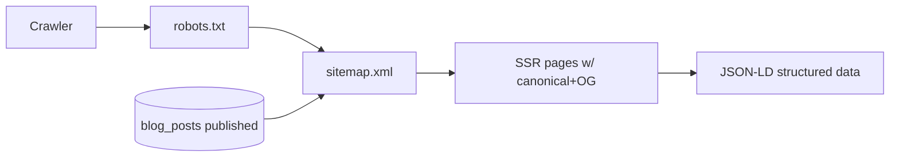

# 19. SEO

**Status:** Implemented
**Last verified against commit:** 26c8ce4 · 2026-06-29

## 1. Purpose & Scope

How the site is made discoverable: crawlability, structured data, social
previews, and the sitemap — all serving the install-driving goal.

## 2. Implementation

- **Sitemap (`src/routes/sitemap[.]xml.ts`).** Generated at request time; **auto-
  includes published blog posts** alongside static routes.
- **robots.txt** is live and references the sitemap.
- **Per-route metadata.** Each public route's `head()` sets title, description,
  canonical, and Open Graph tags (SSR — present in initial HTML for crawlers).
- **Structured data (JSON-LD).** Homepage emits Organization / WebSite /
  SoftwareApplication; blog posts emit `BlogPosting` (Ch. 17). Legal pages carry
  canonical + OG.
- **SSR.** Because TanStack Start renders on the server, meta and content are in
  the initial response — no JS execution required for indexing.

> Operator step (not auto-injected): Google Search Console verification `<meta>`
> must be added manually (or DNS/HTML-file method), then submit
> `/sitemap.xml` (`LAUNCH.md` §4).

## 3. User & Data Flows

## 4. Dependencies

- Blog (Ch. 17), website routes (Ch. 09), SSR (Ch. 04).

## 5. Limitations & Known Issues

- Search Console verification + submission are manual operator steps.
- OG images are largely token-rendered/static rather than per-page generated.
- No automated SEO regression checks (Ch. 23).

## 6. Planned Future Improvements

- Dynamic per-post OG image generation.
- Automated meta/JSON-LD validation in CI.

---
**Source Files**
- `src/routes/sitemap[.]xml.ts`
- per-route `head()` across `src/routes/*`
- `src/routes/blog.$slug.tsx` (JSON-LD), `docs/LAUNCH.md` §4
