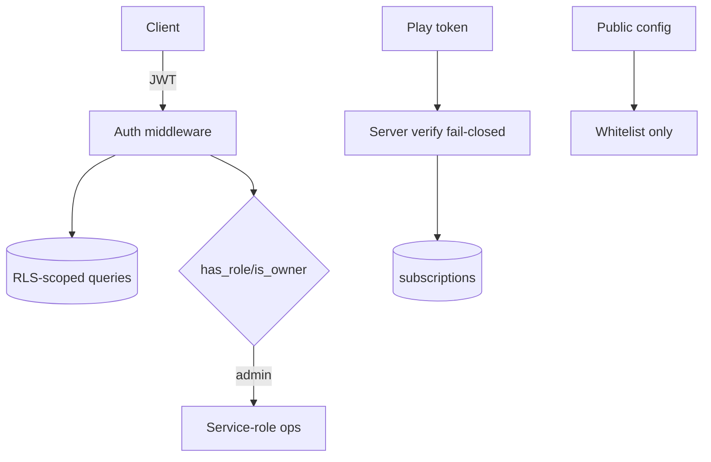

# 20. Security

**Status:** Implemented (with tracked hardening items)
**Last verified against commit:** 26c8ce4 · 2026-06-29

## 1. Purpose & Scope

The security posture: authentication, authorisation, data access boundaries,
secret handling, payment integrity, and content safety — plus honest gaps.

## 2. Implementation

**Authentication.** JWT-based; server functions verify tokens via
`requireSupabaseAuth` → `supabase.auth.getClaims` and require a `sub` claim
(Ch. 11). Malformed/missing/non-Bearer tokens are rejected.

**Authorisation & data isolation.** Row-Level Security on user-owned tables, with
role logic centralised in SECURITY DEFINER helpers (`has_role`, `is_owner`,
`has_active_subscription`). Admin operations verify role **server-side**, not by
trusting client state (Ch. 06, 10).

**Two-identity client boundary.** The browser uses the publishable (RLS-enforced)
key; the service-role key is server-only, lazily constructed, and explicitly
warned against client import (`client.server.ts`). This prevents privilege
escalation from the client bundle.

**Payment integrity.** Google Play purchase verification happens **server-side
against the Play Developer API** and **fails closed** without the service account
— the client can never grant Pro (Ch. 12). Entitlements are written only after
verification.

**Secret handling.** All secrets are server-only env vars (`SUPABASE_SERVICE_
ROLE_KEY`, `GOOGLE_PLAY_*`, `LOVABLE_API_KEY`); only `VITE_*` values reach the
client. Public site config is exposed through a **whitelisted** server function
(`getPublicSiteConfig`) so non-whitelisted `app_settings` never leak.

**Content safety.** Blog markdown is rendered by a dependency-free, **XSS-safe**
renderer that escapes HTML (no `dangerouslySetInnerHTML`) (Ch. 17). Inputs to
server functions are Zod-validated where present (Ch. 06).

**Retired attack surface.** The legacy web-payment webhook returns HTTP 410, so
there is no live unauthenticated payment endpoint (Ch. 12).

## 3. User & Data Flows

## 4. Dependencies

- Auth (Ch. 11), DB/RLS (Ch. 05), billing (Ch. 12), config (Ch. 10).

## 5. Limitations & Known Issues

- **No app-layer rate-limiting** on auth or server functions (relies on Supabase
  defaults) — hardening item.
- **No admin audit log** (Ch. 10).
- Not every input-taking handler has an explicit Zod validator (Ch. 06).
- No automated security tests / dependency scanning in CI (Ch. 23).
- Stale `types.ts` + `any` casts reduce compile-time safety (Ch. 05).

## 6. Planned Future Improvements

- Rate-limiting/abuse protection on auth + sensitive server functions.
- Admin audit trail; CI dependency + secret scanning.
- Complete Zod coverage on all inputs.

---
**Source Files**
- `src/integrations/supabase/auth-middleware.ts`, `client.server.ts`
- `src/lib/billing.functions.ts`, `src/lib/markdown.tsx`, `src/lib/site-config.functions.ts`
- `supabase/migrations/*` (RLS + SECURITY DEFINER helpers)
