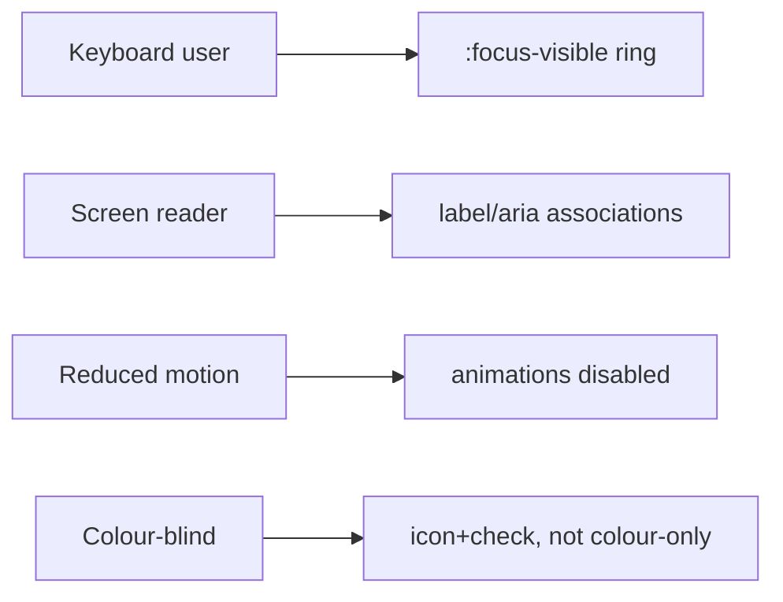

# 21. Accessibility

**Status:** Implemented (baseline strong; full audit ongoing)
**Last verified against commit:** 26c8ce4 · 2026-06-29

## 1. Purpose & Scope

The accessibility posture across the app and site, grounded in the design-audit
ledger (`docs/DESIGN_AUDIT.md`) and the component implementations.

## 2. Implementation

**Global foundations (`src/styles.css`).** A global `:focus-visible` ring
(WCAG 2.4.7), branded `::selection`, smooth scroll, and a
`prefers-reduced-motion` reset that disables non-essential animation.

**Forms & inputs.** Auth, forgot/reset-password, support, feedback, and progress
forms carry proper `htmlFor`/`id` label association, mobile input attributes
(`inputMode`, `autoComplete`, `autoCapitalize`, `spellCheck`), password reveal
toggles, visible (not `sr-only`) headings, and live inline validation
(`DESIGN_AUDIT.md` → Authentication/Application screens).

**Semantics & state.** Onboarding choices use `aria-pressed` and add an icon +
explicit check on selection to avoid colour-only signalling (WCAG 1.4.1); the
progress bar exposes `role=progressbar` + aria values; category selectors use
`role=group`; dialogs (feedback) have accessible names and support
Enter-to-submit; clickable cards have hover/focus affordances.

**Motion.** Animations route through motion tokens and are suppressed under
reduced-motion, so vestibular-sensitive users get a calm experience.

## 3. User & Data Flows

## 4. Dependencies

- `src/styles.css`, Radix UI primitives (accessible by default), the audited
  routes/components (Ch. 07), `docs/DESIGN_AUDIT.md`.

## 5. Limitations & Known Issues

- **No automated a11y test** (axe/Lighthouse) in CI; verification is
  code-level + manual.
- A full screen-reader pass and colour-contrast audit across every screen is
  still in progress (`DESIGN_AUDIT.md` outstanding items).
- Pixel-level contrast verification benefits from the rendered preview, which is
  not available in the doc-build environment.

## 6. Planned Future Improvements

- Add automated axe/Lighthouse checks to CI.
- Complete the per-screen contrast + screen-reader audit.

---
**Source Files**
- `src/styles.css`
- `docs/DESIGN_AUDIT.md`
- audited routes: `auth.tsx`, `forgot/reset-password.tsx`, `_app.onboarding.tsx`,
  `_app.support.tsx`, `_app.feedback.tsx`, `_app.progress.tsx`
