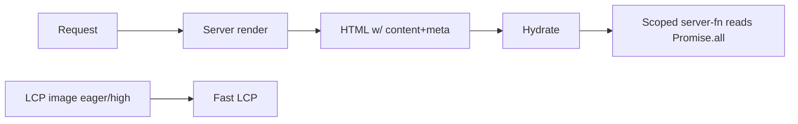

# 22. Performance

**Status:** Implemented (baseline; no formal benchmarking)
**Last verified against commit:** 26c8ce4 · 2026-06-29

## 1. Purpose & Scope

The performance characteristics and the deliberate choices that keep the product
fast and cheap to run, plus the measurement gaps.

## 2. Implementation

- **SSR + hydration.** TanStack Start renders HTML on the server, so first paint
  and crawlable content arrive without waiting on client JS (Ch. 04, 19).
- **No per-request AI.** Personalisation is a pure in-process function
  (`fitness-engine.ts`) — no external inference latency or cost (Ch. 13–14).
- **Local datasets.** Countries (199) and daily tips ship in-code — instant, no
  network round-trip.
- **Image loading strategy.** Per-image `loading`/`fetchPriority` (eager + high
  priority for the LCP hero, lazy + async below the fold) — `DESIGN_AUDIT.md`
  (`4a1e064`).
- **Analytics is non-blocking.** `track()` is best-effort and never throws
  (`analytics.ts`); third-party tags load only when configured (Ch. 16).
- **Scoped data fetching.** Server functions fetch exactly what a screen needs,
  often via `Promise.all` (e.g. plan generation batches profile/subscription/
  settings reads).
- **Lean delivery target.** Nitro builds for an edge target (Cloudflare default
  from the preset); generated PDF/diagram artifacts are gitignored to keep the
  repo/branch light.

## 3. User & Data Flows

## 4. Dependencies

- SSR runtime (Ch. 04), engine (Ch. 13–14), analytics (Ch. 16).

## 5. Limitations & Known Issues

- **No formal performance benchmarking** (Lighthouse/Web Vitals budgets) in CI or
  documented baselines — claims here are architectural, not measured.
- No bundle-size budget enforcement.
- `vite build` cannot be run in the documentation environment, so build-output
  size is not measured here.

## 6. Planned Future Improvements

- Add Lighthouse CI + Web Vitals budgets.
- Track and enforce client bundle size.

---
**Source Files**
- `src/lib/fitness-engine.ts`, `src/lib/analytics.ts`, `src/lib/countries.ts`
- `docs/DESIGN_AUDIT.md` (image loading), `vite.config.ts`
