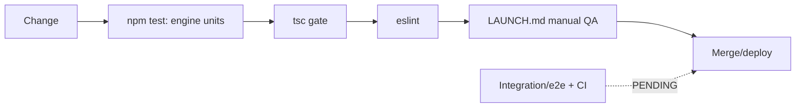

# 23. Testing

**Status:** Partial (engine unit-tested; broader automated coverage still pending)
**Last verified against commit:** 90a29e1 · 2026-06-29

## 1. Purpose & Scope

An honest account of how the codebase is verified today and what is missing. Per
Prime Directive #5, this chapter does not overstate coverage.

## 2. Implementation

**What exists.**

- **Engine unit tests (NEW).** `src/lib/fitness-engine.test.ts` — 14 tests
  covering the core IP: `bmr` (Mifflin–St Jeor, sex constants), `calorieTargets`
  (multiplier, goal adjust, the 1200 kcal floor, protein/kg), `generateMealPlan`
  (all four meals, ≥20 g portions, **local-over-global** preference, global
  fallback, empty-catalog safety), and `pickWorkoutTemplate` (activity→level
  mapping, maintain↔lose_fat borrowing, null fallback). They run on **Node's
  built-in test runner with TypeScript type-stripping** — *zero* test-framework
  dependency, so nothing can conflict with the pinned Vite toolchain:
  `npm test` → `node --test --experimental-strip-types "src/**/*.test.ts"`.
  This was chosen deliberately over Vitest because the project pins an unusual
  Vite 8 and the branch syncs to Lovable (must stay build-clean).
- **Type checking.** `tsc` is the primary gate; the codebase targets zero real
  type errors (a small set of environment-only errors is the documented
  baseline). Pure modules like `fitness-engine.ts` are side-effect-free precisely
  so they are deterministic and testable — now exercised.
- **Linting.** ESLint 9 (flat config) + typescript-eslint + prettier
  (`eslint.config.js`); `npm run lint`.
- **Manual QA checklist.** `LAUNCH.md` §8 is a concrete pre-launch script.

**What does not exist yet.** No **integration/e2e** tests (server functions, RLS,
billing-result handling, signup→plan flow) and **no CI pipeline** wiring the
above. Coverage today = engine unit tests + static analysis + human QA.

## 3. User & Data Flows

## 4. Dependencies

- TypeScript, ESLint/prettier; `LAUNCH.md` QA checklist.

## 5. Limitations & Known Issues

- The **engine** is now covered, but the **entitlement gate, billing-result
  handling, and RLS** are not yet exercised by automated tests — regressions
  there would still escape CI.
- **No CI pipeline** runs `npm test` automatically yet.
- No coverage measurement.

## 6. Planned Future Improvements

- Server-function integration tests around the entitlement gate and billing
  verification result handling.
- Playwright smoke e2e for signup→onboarding→plan.
- Wire `npm test` (+ `tsc`/`lint`) into CI as a required gate.

---
**Source Files**
- `src/lib/fitness-engine.test.ts` (14 tests), `package.json` (`test` script)
- `eslint.config.js`, `docs/LAUNCH.md` §8
