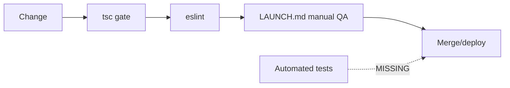

# 23. Testing

**Status:** Partial (static verification only; no automated test suite)
**Last verified against commit:** 26c8ce4 · 2026-06-29

## 1. Purpose & Scope

An honest account of how the codebase is verified today and what is missing. Per
Prime Directive #5, this chapter does not overstate coverage.

## 2. Implementation

**What exists.**

- **Type checking.** `tsc` is the primary gate; the codebase targets zero real
  type errors (a small set of environment-only errors is the documented
  baseline). Pure modules like `fitness-engine.ts` are written as side-effect-free
  functions specifically so they are deterministic and *testable*.
- **Linting.** ESLint 9 (flat config) + typescript-eslint + prettier
  (`eslint.config.js`); `npm run lint`. The dev loop uses `eslint --fix` plus a
  check that ignores prettier-only/any/exhaustive-deps noise.
- **Manual QA checklist.** `LAUNCH.md` §8 is a concrete pre-launch script
  (signup→onboarding→plan, gating, support/feedback, admin publish→sitemap,
  keyboard nav, billing copy).

**What does not exist.** There is **no unit/integration/e2e test runner** in
`package.json` (no Vitest/Jest/Playwright test setup), and **no CI test
pipeline**. Coverage is therefore static analysis + human QA, not automated
behavioural testing.

## 3. User & Data Flows

## 4. Dependencies

- TypeScript, ESLint/prettier; `LAUNCH.md` QA checklist.

## 5. Limitations & Known Issues

- **No automated tests** — the single biggest quality gap. Regressions in the
  entitlement gate, the engine, or RLS would not be caught automatically.
- No coverage measurement; no CI.

## 6. Planned Future Improvements

- Add **Vitest** unit tests for the pure engine (`calorieTargets`,
  `generateMealPlan`, `pickWorkoutTemplate`, `pickFoods`) — highest ROI, zero
  external deps.
- Server-function integration tests around the entitlement gate and billing
  verification result handling.
- Playwright smoke e2e for signup→onboarding→plan; wire all into CI.

---
**Source Files**
- `package.json` (scripts; note absence of a test runner)
- `eslint.config.js`, `docs/LAUNCH.md` §8
