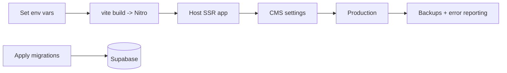

# 24. Deployment

**Status:** Implemented (process documented; operator-run)
**Last verified against commit:** 26c8ce4 · 2026-06-29

## 1. Purpose & Scope

How to take this build to production: environment, build target, database
migrations, storage, configuration, and monitoring. The authoritative operator
runbook is `docs/LAUNCH.md`; this chapter is the architectural summary.

## 2. Implementation

**Build & runtime.** Vite builds the SSR app; Nitro produces the server bundle
(`vite.config.ts` redirects the entry to `src/server.ts`). The preset's default
Nitro target is Cloudflare; confirm the actual host before go-live.

**Environment variables** (`LAUNCH.md` §1). Client `VITE_*` (Supabase URL/key,
`VITE_PLAY_STORE_URL`) are build-time inlined; server secrets (`SUPABASE_SERVICE_
ROLE_KEY`, `SUPABASE_URL/PUBLISHABLE_KEY`, `GOOGLE_PLAY_*`, `LOVABLE_*`) are set in
the host. Missing Supabase vars cause an explicit startup error (Ch. 04).

**Database.** Apply pending migrations (`supabase db push` or SQL editor) —
notably `…_feature_requests.sql`, `…_blog.sql`, `…_media_library.sql`. Grant the
first `admin`/`owner` role via `user_roles` (or owner-bootstrap). Buckets:
`avatars` (existing), `media` (from the media migration).

**Configuration without redeploy.** Support email, socials, announcement, GA4 &
Clarity IDs are set in Admin → Settings (`app_settings`).

**Pipeline.**

## 3. User & Data Flows

Errors are captured via `src/lib/lovable-error-reporting.ts` (root boundary in
`__root.tsx`). Post-deploy, confirm error capture and watch Admin → Analytics +
Clarity (`LAUNCH.md` §9).

## 4. Dependencies

- Supabase project (DB/Auth/Storage), host (Cloudflare/edge), env secrets,
  optional email + analytics providers.

## 5. Limitations & Known Issues

- Migrations + role grant + CMS config are **manual operator steps** (blocked on
  credentials, not code).
- The production host target should be explicitly confirmed/documented (preset
  defaults to Cloudflare).
- No CI/CD pipeline is defined in-repo (Ch. 23).

## 6. Planned Future Improvements

- Define CI/CD (build, type-check, lint, future tests, deploy).
- Codify the host target and backup/PITR policy.

---
**Source Files**
- `docs/LAUNCH.md`, `vite.config.ts`
- `src/integrations/supabase/client.server.ts`, `src/lib/lovable-error-reporting.ts`
- `supabase/migrations/*`
