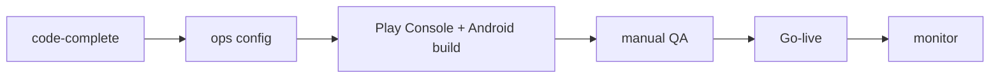

# 25. Launch Checklist

**Status:** Implemented (checklist; gated on operator/external steps)
**Last verified against commit:** 26c8ce4 · 2026-06-29

## 1. Purpose & Scope

The concrete go-live checklist, distilled from `docs/LAUNCH.md` and the
Limitations sections of every chapter. Items are marked by who can complete them:
**[code]** done in-repo · **[ops]** operator/credentials · **[ext]** external
service/build.

## 2. Implementation

**Environment & data**
- [ops] Set client `VITE_*` + server secrets in production.
- [ops] Apply 3 pending migrations (feature_requests, blog, media).
- [ops] Grant first `admin`/`owner` role; confirm `avatars` + `media` buckets.

**Configuration**
- [ops] Admin → Settings: support email, socials, announcement, GA4, Clarity.
- [ops] Search Console: verify domain, submit `/sitemap.xml`.

**Billing (Android-first)**
- [ext] Play Console: create `fitplancoach_pro_monthly` + `_annual` (exact IDs).
- [ext] Create Play Developer API service account; set `GOOGLE_PLAY_*`.
- [code] Server verification already implemented + fails closed (Ch. 12). ✔
- [ext] Build/sign Android wrapper; wire Play Billing plugin; set
  `VITE_PLAY_STORE_URL`; bump `app-config.ts` version codes.
- [ext] Verify end-to-end: purchase monthly + annual, restore, cancellation.

**Quality gates**
- [code] `tsc` clean (no real errors); `eslint` clean. ✔ (per dev loop)
- [ops] Run `LAUNCH.md` §8 manual QA script (signup→plan, gating, admin, a11y).
- [ ] (gap) Automated tests — none yet (Ch. 23).

**Operations**
- [ops] Enable Supabase backups (PITR if available).
- [ops] Confirm error reporting captures post-deploy (Ch. 24).
- [ops] Watch Admin → Analytics + Clarity after launch.

## 3. User & Data Flows

## 4. Dependencies

- All feature chapters' Limitations; `LAUNCH.md` §1–§10.

## 5. Limitations & Known Issues

- The **only items blocking launch are [ops]/[ext]** — code is release-ready for
  the web surface; the native purchase path needs the Android build + Play
  Console (Ch. 08, 12).
- No automated test gate (Ch. 23) — manual QA is the current safety net.

## 6. Planned Future Improvements

- Convert this checklist into a CI release gate where possible.

---
**Source Files**
- `docs/LAUNCH.md` (§1–§10)
- `src/lib/billing.functions.ts`, `src/lib/app-config.ts`
